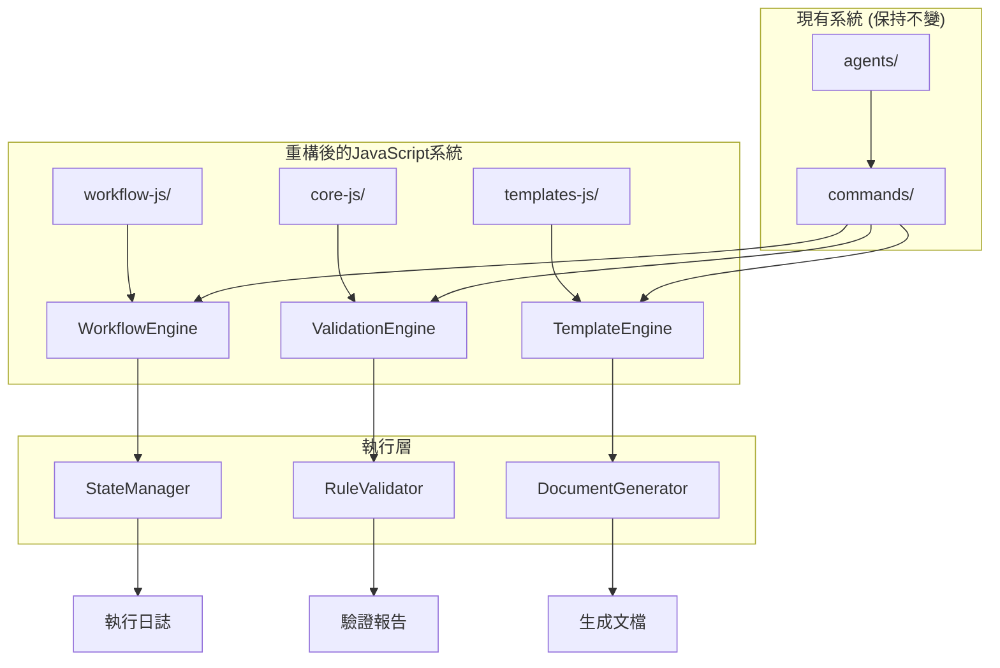

# Design Document

## Overview

本設計文檔描述如何將現有AI多agent協作工作體系中的workflow、core和templates從YAML/Markdown自然語言描述重構為JavaScript代碼實現。設計遵循Midscene的結構化API理念，將複雜的自然語言工作流程轉換為可執行、可維護的JavaScript函數。

## Architecture

### 核心架構原則

1. **保持現有接口** - agents和commands目錄保持不變，確保向後兼容性
2. **結構化執行** - 將YAML工作流程轉換為JavaScript狀態機
3. **數據驅動驗證** - 將自然語言規範轉換為可執行的驗證函數
4. **模板生成器** - 將YAML模板轉換為JavaScript生成器函數
5. **漸進式遷移** - 支持新舊系統並存，逐步遷移

### 系統架構圖



## Components and Interfaces

### 1. WorkflowEngine (工作流程引擎)

負責執行JavaScript化的工作流程，替代原有的YAML工作流程。

```javascript
class WorkflowEngine {
  constructor(workflowDefinition) {
    this.definition = workflowDefinition;
    this.stateManager = new StateManager();
  }
  
  async execute(inputs) {
    // 執行工作流程邏輯
  }
  
  async validateStage(stageId, context) {
    // 驗證階段完成度
  }
  
  async transitionTo(nextStage, context) {
    // 狀態轉換邏輯
  }
}
```

**接口定義:**
- `execute(inputs)` - 執行完整工作流程
- `validateStage(stageId, context)` - 驗證特定階段
- `transitionTo(nextStage, context)` - 執行狀態轉換
- `getExecutionLog()` - 獲取執行日誌

### 2. ValidationEngine (驗證引擎)

將core目錄中的自然語言規範轉換為可執行的驗證邏輯。

```javascript
class ValidationEngine {
  constructor(enforcementRules) {
    this.rules = this.compileRules(enforcementRules);
  }
  
  async validateCompliance(context, developerType) {
    // 執行合規性驗證
  }
  
  async checkPreconditions(requirements) {
    // 檢查前置條件
  }
  
  async enforceQualityGates(metrics) {
    // 執行品質門檻檢查
  }
}
```

**接口定義:**
- `validateCompliance(context, developerType)` - 執行開發者類型特定的合規性檢查
- `checkPreconditions(requirements)` - 檢查前置條件
- `enforceQualityGates(metrics)` - 執行品質門檻驗證
- `generateComplianceReport()` - 生成合規性報告

### 3. TemplateEngine (模板引擎)

將YAML模板轉換為JavaScript生成器函數，支持動態內容生成。

```javascript
class TemplateEngine {
  constructor(templateDefinition) {
    this.template = this.compileTemplate(templateDefinition);
  }
  
  async generate(data, context) {
    // 生成文檔內容
  }
  
  async validateTemplate(data) {
    // 驗證模板數據完整性
  }
  
  async populateSection(sectionName, data) {
    // 填充特定章節
  }
}
```

**接口定義:**
- `generate(data, context)` - 生成完整文檔
- `validateTemplate(data)` - 驗證模板數據
- `populateSection(sectionName, data)` - 填充特定章節
- `getRequiredFields()` - 獲取必填字段列表

### 4. 數據提取API (類似Midscene)

提供結構化的數據提取方法，替代自然語言描述。

```javascript
class AgentDataExtractor {
  async agentBoolean(prompt, context) {
    // 提取布爾值
  }
  
  async agentString(prompt, context) {
    // 提取字符串
  }
  
  async agentNumber(prompt, context) {
    // 提取數值
  }
  
  async agentQuery(dataDemand, context) {
    // 提取結構化數據
  }
}
```

## Data Models

### WorkflowDefinition

```javascript
const workflowDefinition = {
  name: string,
  version: string,
  stages: [
    {
      id: string,
      title: string,
      mandatory: boolean,
      validationCheckpoint: boolean,
      actions: [
        {
          type: 'read' | 'validate' | 'execute' | 'check',
          target: string,
          conditions: object,
          onSuccess: string,
          onFailure: string
        }
      ],
      transitions: {
        success: string,
        failure: string,
        conditional: object
      }
    }
  ],
  errorHandling: {
    retryPolicy: object,
    fallbackActions: object
  }
};
```

### ValidationRule

```javascript
const validationRule = {
  id: string,
  name: string,
  severity: 'blocker' | 'high' | 'medium' | 'low',
  condition: function(context) {
    // 返回驗證結果
  },
  message: string,
  remediation: string,
  applicableTypes: ['backend', 'frontend', 'fullstack', 'refactor']
};
```

### TemplateDefinition

```javascript
const templateDefinition = {
  name: string,
  version: string,
  sections: [
    {
      name: string,
      required: boolean,
      generator: function(data, context) {
        // 生成章節內容
      },
      validator: function(content) {
        // 驗證章節內容
      }
    }
  ],
  dependencies: [string],
  outputFormat: 'markdown' | 'yaml' | 'json'
};
```

## Error Handling

### 錯誤分類和處理策略

1. **工作流程執行錯誤**
   - 階段驗證失敗 → 暫停並要求修復
   - 狀態轉換錯誤 → 回滾到上一個穩定狀態
   - 超時錯誤 → 執行重試策略

2. **驗證錯誤**
   - 合規性檢查失敗 → 阻止繼續執行
   - 品質門檻未達標 → 要求改進後重新驗證
   - 前置條件不滿足 → 提供具體的修復指導

3. **模板生成錯誤**
   - 數據不完整 → 標識缺失字段並要求補充
   - 格式驗證失敗 → 提供格式修正建議
   - 依賴缺失 → 自動解析並載入依賴

### 錯誤恢復機制

```javascript
class ErrorRecoveryManager {
  async handleWorkflowError(error, context) {
    switch(error.type) {
      case 'VALIDATION_FAILED':
        return this.pauseAndRequestFix(error, context);
      case 'STATE_TRANSITION_ERROR':
        return this.rollbackToStableState(context);
      case 'TIMEOUT_ERROR':
        return this.executeRetryStrategy(error, context);
      default:
        return this.escalateError(error, context);
    }
  }
  
  async generateRecoveryPlan(error, context) {
    // 生成具體的恢復計劃
  }
}
```

## Testing Strategy

### 單元測試

1. **WorkflowEngine測試**
   - 各階段執行邏輯測試
   - 狀態轉換測試
   - 錯誤處理測試

2. **ValidationEngine測試**
   - 規則編譯測試
   - 驗證邏輯測試
   - 合規性檢查測試

3. **TemplateEngine測試**
   - 模板編譯測試
   - 內容生成測試
   - 格式驗證測試

### 整合測試

1. **端到端工作流程測試**
   - 完整的開發者工作流程執行
   - 多階段驗證流程
   - 錯誤恢復流程

2. **向後兼容性測試**
   - 現有agents和commands的兼容性
   - 數據格式兼容性
   - API接口兼容性

### 性能測試

1. **執行效率測試**
   - 工作流程執行時間對比
   - 記憶體使用量測試
   - 並發執行測試

2. **可擴展性測試**
   - 大量工作流程並行執行
   - 複雜驗證規則性能
   - 大型模板生成性能

## Migration Strategy

### 階段性遷移計劃

**階段1: 基礎設施建設**
- 建立JavaScript執行引擎
- 實現基本的數據提取API
- 建立測試框架

**階段2: 工作流程遷移**
- 轉換unified-developer-workflow.yaml
- 轉換unified-task-planning-workflow.yaml
- 實現狀態管理和轉換邏輯

**階段3: 驗證規則遷移**
- 轉換core目錄中的enforcement文件
- 實現驗證引擎
- 建立合規性檢查機制

**階段4: 模板系統遷移**
- 轉換templates目錄中的YAML模板
- 實現動態內容生成
- 建立模板驗證機制

**階段5: 整合和優化**
- 系統整合測試
- 性能優化
- 文檔更新和培訓

### 向後兼容性保證

1. **API兼容性**
   - 保持現有的commands接口不變
   - 提供適配器層處理新舊系統差異
   - 漸進式API升級路徑

2. **數據兼容性**
   - 支持讀取現有的YAML配置
   - 提供數據遷移工具
   - 保持輸出格式一致性

3. **功能兼容性**
   - 確保所有現有功能在新系統中可用
   - 提供功能對照表
   - 建立回退機制

## Implementation Considerations

### 技術選型

1. **JavaScript執行環境**
   - Node.js作為主要執行環境
   - 支持ES6+語法特性
   - 使用async/await處理異步操作

2. **狀態管理**
   - 使用內存狀態管理器
   - 支持狀態持久化
   - 實現狀態快照和恢復

3. **模板引擎**
   - 使用JavaScript模板字符串
   - 支持條件邏輯和循環
   - 實現模板繼承和組合

### 性能優化

1. **執行效率**
   - 使用函數緩存減少重複計算
   - 實現懶加載機制
   - 優化狀態轉換邏輯

2. **記憶體管理**
   - 及時清理不需要的狀態
   - 使用對象池減少GC壓力
   - 實現內存使用監控

3. **並發處理**
   - 支持多工作流程並行執行
   - 實現資源隔離機制
   - 提供執行優先級控制

### 可觀測性

1. **執行日誌**
   - 詳細的階段執行日誌
   - 狀態轉換追蹤
   - 錯誤堆棧信息

2. **性能監控**
   - 執行時間統計
   - 資源使用監控
   - 瓶頸識別和分析

3. **調試支持**
   - 斷點調試支持
   - 狀態檢查工具
   - 執行流程可視化