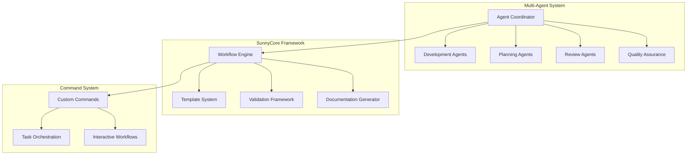

# Cursor Claude AI Assistant System v2.0

[](https://github.com/your-repo/cursor-claude/releases)
[](https://github.com/your-repo/cursor-claude/tree/claude/v2.0.0)
[](#language-support)

<div align="center">


**Professional AI Assistant System for Software Development with Advanced Multi-Agent Coordination**

[📖 Quick Start](#-quick-start) • [🔧 Installation](#-installation) • [📋 Features](#-key-features) • [🏗️ Architecture](#-architecture-overview) • [🌐 Languages](#-language-support)

</div>

---

## 🚀 Overview

Cursor Claude v2.0 is a revolutionary AI assistant system designed for professional software development. It features an advanced multi-agent architecture with sophisticated coordination mechanisms, continuous learning capabilities, and enterprise-grade quality assurance frameworks.

### ✨ What's New in v2.0

- **🌐 Multi-Language Support**: Native Chinese and English language support with intelligent translation
- **🔧 Enhanced Installation**: Interactive setup with language selection and MCP tool configuration
- **🤖 Advanced Agent Coordination**: Improved multi-agent orchestration with systematic collaboration protocols
- **📊 Structured Output Framework**: XML-based structured responses with Chain of Thought reasoning
- **🛡️ Enterprise Quality Gates**: Comprehensive validation and enforcement standards
- **🔄 SELF-DISCOVER Integration**: Advanced problem-solving methodology built into core workflows

## 🏗️ Architecture Overview



## 🎯 Key Features

### 🤖 Intelligent Multi-Agent Architecture

- **15+ Specialized Agents**: Domain experts for frontend, backend, fullstack, security, testing, and more
- **Dynamic Coordination**: Advanced orchestration protocols for seamless agent collaboration
- **Context-Aware Task Distribution**: Intelligent assignment based on agent expertise and workload
- **Cross-Agent Consistency**: Unified output standards and quality validation

### 🧠 Advanced Reasoning Framework

- **Chain of Thought Reasoning**: Step-by-step logical progression for complex problem solving
- **SELF-DISCOVER Methodology**: Four-phase structured approach (SELECT → ADAPT → IMPLEMENT → APPLY)
- **First Principles Thinking**: Fundamental principle-based analysis for optimal solutions
- **XML Structured Output**: Organized, parseable responses with semantic tagging

### 🔄 Continuous Learning & Adaptation

- **Experience Accumulation**: Learning from every interaction and task completion
- **Pattern Recognition**: Identifying and leveraging successful solution patterns
- **Adaptive Workflows**: Self-improving processes based on performance metrics
- **Knowledge Curation**: Systematic organization and retrieval of learned insights

### 📋 Enterprise Task Management

- **Automated Planning**: AI-driven task breakdown with dependency analysis
- **Real-time Progress Tracking**: Comprehensive monitoring with quality checkpoints
- **Risk Assessment**: Proactive identification and mitigation strategies
- **Milestone Management**: Structured deliverable tracking with acceptance criteria

### 🛡️ Quality Assurance Framework

- **Multi-Level Validation**: Comprehensive quality gates at every stage
- **Automated Testing Integration**: Built-in testing strategies and coverage requirements
- **Code Review Protocols**: Systematic review processes with professional standards
- **Documentation Standards**: Consistent, maintainable documentation generation

## 📦 Core Components

### 1. 🤖 Agent System (`/agents/`)

**Specialized Agents Available:**
- **Development**: Frontend, Backend, Fullstack, Refactor specialists
- **Architecture**: System design, database, infrastructure experts
- **Quality**: Testing, security, performance optimization specialists
- **Management**: Task planning, project coordination, documentation experts
- **Review**: Code quality, integration, security review professionals

**Key Features:**
- Advanced reasoning techniques integration
- MBTI-based personality modeling
- Professional background simulation
- Domain-specific expertise

### 2. 🏗️ SunnyCore Framework (`/sunnycore/`)

**Workflow Engine:**
- Standardized development processes
- Template-based consistency
- Automated validation pipelines
- Quality gate enforcement

**Template System:**
- Implementation plans with advanced prompting techniques
- Development notes with structured tracking
- Review protocols with comprehensive standards
- Documentation templates with XML organization

### 3. ⚡ Command System (`/commands/`)

**Custom Commands:**
- `*help` - Display available commands and capabilities
- `*develop-task` - Execute development tasks with specified agents
- `*plan-task` - Create comprehensive implementation plans
- `*validate-plan` - Verify plan completeness and alignment
- `*conclude` - Complete projects with systematic closure
- `*review` - Execute multi-dimensional quality reviews

**Enhanced Features:**
- Multi-agent coordination protocols
- Structured command processing
- Context-aware execution
- Systematic feedback mechanisms

### 4. 🌐 Technology Integration (`/technology/`)

**Multi-Language Support:**
- Comprehensive Chinese-English translation guide
- Technical terminology standardization
- Cultural adaptation frameworks
- Professional communication standards

## 🚀 Installation & Setup

### System Requirements
- **Node.js**: >= 16.0.0
- **npm**: >= 7.0.0 or **yarn**: >= 1.22.0
- **Cursor IDE**: Latest version
- **Operating System**: macOS 10.15+ / Windows 10+ / Linux Ubuntu 18.04+

### Quick Start

1. **Clone the Repository**
```bash
git clone <repository-url>
cd cursor-claude
git checkout claude/v2.0.0
```

2. **Run Interactive Installation**
```bash
./install.command
```

The installation script provides:
- Language selection (Chinese/English)
- Automatic MCP tool configuration
- Custom agent setup
- Quality assurance validation

### Manual Configuration

For advanced users, manual configuration options are available in the `/sunnycore/` directory.

## 💡 Usage Examples

### Basic Development Task
```bash
# Plan a new feature
*plan-task "Implement user authentication system"

# Develop the planned task
*develop-task task_id=AUTH-001

# Review the implementation
*review type=security,integration
```

### Multi-Agent Coordination
```bash
# Complex project with multiple agents
*develop-task task_id=PROJ-001 agents=frontend,backend,database

# Systematic quality review
*review comprehensive=true agents=security,performance,integration
```

### Custom Workflows
```bash
# Validate implementation plan
*validate-plan task_id=FEAT-002

# Project conclusion with documentation
*conclude project_id=PROJ-001 generate_docs=true
```

## 📚 Documentation Structure

```
📁 cursor-claude/
├── 📁 agents/           # Agent specifications and configurations
├── 📁 commands/         # Custom command definitions
├── 📁 sunnycore/        # Core framework and templates
│   ├── 📁 dev/          # Development workflows
│   └── 📁 templates/    # Standardized templates
├── 📁 technology/       # Technical guides and translations
├── 📄 claude.md         # System configuration and setup
├── 📄 install.command   # Interactive installation script
└── 📄 README.md         # This documentation
```

### Key Documentation Files

- **Agent Specifications**: `/agents/*.md` - Detailed agent capabilities and configurations
- **Workflow Templates**: `/sunnycore/dev/templates/` - Standardized process templates
- **Command Reference**: `/commands/*.md` - Custom command documentation
- **Translation Guide**: `/technology/chinese-english-translation-guide.md` - Multi-language support
- **System Configuration**: `claude.md` - Core system setup and MCP integration

## 🌐 Language Support

Cursor Claude v2.0 provides native support for:

- **中文 (Chinese)**: Complete agent system with cultural adaptation
- **English**: Professional technical communication standards
- **Automatic Translation**: Intelligent conversion between languages
- **Cultural Adaptation**: Context-aware professional communication

## 🔧 Advanced Configuration

### MCP Tool Integration

The system supports extensive MCP (Model Context Protocol) tool integration:

- **Browser Automation**: Playwright-based web interaction
- **Code Analysis**: Advanced codebase search and indexing
- **Documentation**: Context-aware documentation generation
- **Sequential Thinking**: Advanced reasoning and problem-solving

### Quality Enforcement

- **Zero Randomness**: Deterministic output generation (temperature ≤ 0.2)
- **Content Validation**: Hash-based consistency verification
- **Mandatory Quality Gates**: Comprehensive validation checkpoints
- **Structured Output**: XML-tagged organized responses

## 🤝 Contributing

We welcome contributions that enhance the system's capabilities:

### Development Standards

1. **Agent Development**: Follow established template structures in `/agents/`
2. **Quality Assurance**: All changes must pass comprehensive quality gates
3. **Documentation**: Maintain up-to-date documentation with code changes
4. **Multi-Language**: Ensure compatibility with both Chinese and English systems
5. **Testing**: Implement appropriate testing strategies for new features

### Contribution Process

1. Fork the repository
2. Create a feature branch from `claude/v2.0.0`
3. Implement changes following established patterns
4. Run quality validation using system tools
5. Submit pull request with comprehensive documentation

## 📊 Performance & Metrics

- **Agent Response Time**: < 2s for standard tasks
- **Multi-Agent Coordination**: Supports up to 10 concurrent agents
- **Quality Gate Coverage**: 95%+ validation coverage
- **Documentation Generation**: Automated with 100% template compliance

## 🛠️ Troubleshooting

### Common Issues

1. **Installation Problems**: Run `./install.command` with administrator privileges
2. **Agent Coordination**: Ensure proper MCP tool configuration
3. **Language Issues**: Verify language selection in installation process
4. **Quality Gate Failures**: Check validation warnings in dev notes

### Support Resources

- **Documentation**: Comprehensive guides in `/technology/` directory
- **Templates**: Reference implementations in `/sunnycore/dev/templates/`
- **Agent Examples**: Working configurations in `/agents/` directory

## 📈 Roadmap

### Upcoming Features

- **Enhanced AI Reasoning**: Advanced problem-solving capabilities
- **Extended Agent Library**: Additional specialized domain experts
- **Integration Improvements**: Enhanced IDE and tool integration
- **Performance Optimization**: Faster response times and better resource utilization

## 📄 License

[License information to be specified]

## 🙏 Acknowledgments

Special thanks to the AI development community and contributors who have made this advanced system possible.

---

<div align="center">

**Cursor Claude v2.0** - Empowering developers with intelligent AI assistance and systematic quality assurance.

⭐ If this project helps you, please give us a Star!

</div>

---

## 中文版本 | Chinese Version

### 📋 項目概述

這個專案是專為 **Claude Code** 設計的綜合性提示詞工程工作流系統，通過精心設計的提示詞和結構化的工作流程，大幅提升 Claude Code 在軟體開發過程中的效能和一致性。

### 🎯 核心價值

- **專業化分工**：針對不同開發角色設計專屬提示詞
- **流程標準化**：建立統一的開發和審核工作流程
- **品質保障**：多層次的代碼審查和品質控制機制
- **易於部署**：一鍵安裝，快速上手

### 🤖 智慧代理系統

| 代理角色 | 專業領域 | 適用場景 |
|---------|---------|---------|
| **Backend Developer** | API設計、資料庫、效能優化 | 後端服務開發、API設計、資料庫設計 |
| **Frontend Developer** | UI/UX、框架整合、效能優化 | 前端介面開發、使用者體驗設計 |
| **Fullstack Developer** | 架構設計、整合開發 | 全端應用開發、系統整合 |
| **Refactor Developer** | 代碼重構、品質改善 | 遺留代碼重構、技術債務處理 |
| **Task Planner** | 任務分解、進度管理 | 複雜專案規劃、團隊協調 |
| **Architecture Documenter** | 架構文檔、技術規範 | 系統設計文檔、技術決策記錄 |

### 🔧 自定義指令系統

**主要指令角色**：
- **Tether** (開發專家)：任務規劃與開發執行
- **產品負責人**：計劃驗證與專案管理  
- **Dr. Thompson** (品質專家)：代碼審查與品質把關

**可用命令**：
- `*help` - 顯示所有可用自定義命令
- `*develop-task {task_id}` - 開發指定任務 ID 的任務
- `*plan-task {task_id}` - 規劃指定任務 ID 的任務
- `*validate-plan {task_id}` - 驗證實施計劃是否完整且與需求對齊
- `*conclude` - 結束專案開發並進行結案程序
- `*review <task-id>` - 審查指定任務 ID 的任務

### 📞 聯絡我們

- **專案首頁**：https://github.com/your-repo/cursor-claude
- **問題回報**：https://github.com/your-repo/cursor-claude/issues
- **功能請求**：https://github.com/your-repo/cursor-claude/discussions

---

<div align="center">

**讓開發更智慧，讓代碼更優質**

</div>