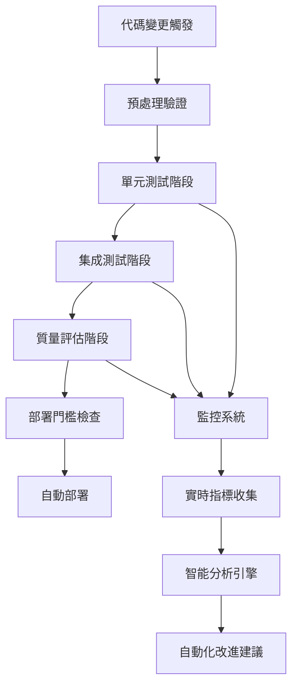

# SUNNYCORE CI/CD 工作流程規範

## 概述

本文檔定義了SUNNYCORE AI代理系統的完整CI/CD測試工作流程，專門針對提示詞工程、AI代理一致性和文檔生成質量的自動化測試與驗證。

## 設計理念

### 核心原則
1. **多維度質量保證**：覆蓋功能、效能、安全性、一致性的全面測試
2. **智能化評估**：結合規則基礎和AI輔助的質量評估機制
3. **持續學習改進**：基於歷史數據的自適應測試策略優化
4. **可觀測性導向**：全程監控和詳細的分析報告

### 測試維度
- **Agent行為一致性**：相同輸入下的輸出穩定性
- **文檔生成質量**：結構完整性和內容規範性
- **工具調用準確性**：工具使用的正確性和效率
- **跨組件協作**：多Agent協同工作的流暢性

## 架構設計

### 技術棧選擇
基於對**Promptfoo**、**BAML**、**Claude Code Templates**和**Claude Code Flow**的深度研究，我們採用以下技術架構：

- **測試引擎**：Promptfoo-like 配置驅動框架
- **斷言系統**：多層次驗證機制（語法→語義→質量）
- **CI/CD平台**：GitHub Actions + 自定義測試執行器
- **監控分析**：實時指標收集和智能化分析

### 系統架構


## CI/CD 管道設計

### 階段1：預處理驗證
**目標**：確保基礎代碼質量和格式規範

```yaml
# .github/workflows/sunnycore-precheck.yml
name: SUNNYCORE Pre-validation
on:
  push:
    paths:
      - 'agents/**/*.md'
      - 'tasks/**/*.md'  
      - 'templates/**/*.yaml'
      - 'config.yaml'

jobs:
  syntax-check:
    runs-on: ubuntu-latest
    steps:
      - name: Markdown語法檢查
        run: |
          find agents tasks -name "*.md" | xargs markdownlint
          
      - name: YAML格式驗證
        run: |
          find templates -name "*.yaml" | xargs yamllint
          
      - name: 配置完整性檢查
        run: |
          python scripts/validate-config.py --config config.yaml
```

### 階段2：Agent一致性測試
**目標**：驗證AI代理的行為穩定性和角色一致性

```yaml
# sunnycore-agent-tests.yaml
providers:
  - id: claude-sonnet
    type: anthropic
    config:
      model: claude-3-5-sonnet-20241022

prompts:
  - file: agents/dev_backend-developer_api.md
  - file: agents/qa_task-reviewer_code-quality.md
  - file: agents/dev_frontend-developer_ui-ux.md

tests:
  # Backend Developer API Agent 一致性測試
  - description: "後端開發代理API設計一致性"
    vars:
      task: "設計用戶認證API"
      requirements: "RESTful架構，JWT認證，rate limiting，OpenAPI規範"
    options:
      provider: claude-sonnet
      runs: 5  # 執行5次確保一致性
    assert:
      - type: similarity
        threshold: 0.85
        description: "多次執行結果相似度需>=85%"
      - type: contains
        value: "swagger"
        description: "必須包含API文檔規範"
      - type: contains  
        value: "JWT"
        description: "必須包含認證機制"
      - type: llm-rubric
        value: "輸出包含完整的API端點定義、請求/回應格式、錯誤處理和安全考量"
      - type: tool-usage-check
        expected: ["api-design", "security-review"]
        description: "必須調用正確的工具"
      - type: latency
        threshold: 15000
        description: "回應時間需<15秒"

  # QA代理代碼審查一致性測試  
  - description: "QA代理代碼審查一致性"
    vars:
      code: |
        function authenticateUser(token) {
          if (!token) return null;
          return jwt.verify(token, process.env.SECRET);
        }
      context: "Node.js API認證函數"
    options:
      provider: claude-sonnet
      runs: 3
    assert:
      - type: similarity
        threshold: 0.80
      - type: contains-any
        values: ["安全", "錯誤處理", "驗證"]
      - type: llm-rubric
        value: "審查意見包含具體的改進建議和最佳實踐引用"
      - type: quality-score
        minimum: 8.0
        scale: 10

  # Frontend Developer UI/UX 一致性測試
  - description: "前端開發代理UI設計一致性"
    vars:
      requirement: "設計用戶登錄頁面"
      constraints: "響應式設計，無障礙支援，Material Design"
    options:
      provider: claude-sonnet  
      runs: 4
    assert:
      - type: similarity
        threshold: 0.82
      - type: contains-all
        values: ["responsive", "accessibility", "Material"]
      - type: llm-rubric
        value: "設計方案包含線框圖思路、組件說明和用戶體驗考量"
      - type: completeness-check
        required_sections: ["設計概念", "組件規劃", "互動流程"]
```

### 階段3：文檔生成一致性測試
**目標**：確保生成文檔的結構完整性和內容規範性

```yaml
# 文檔一致性測試配置
document-consistency-tests:
  # 架構文檔一致性
  - test_name: "architecture_document_consistency"
    template: "templates/architecture-tmpl.yaml" 
    test_cases:
      - input:
          project_name: "電商API系統"
          tech_stack: ["Node.js", "MongoDB", "Redis"]
        runs: 3
        validations:
          - type: structure_consistency
            required_sections: 
              - "系統概述"
              - "架構設計" 
              - "技術選型"
              - "部署方案"
              - "安全考量"
          - type: content_depth
            min_words_per_section: 100
          - type: technical_accuracy
            criteria: "技術術語使用正確，架構圖描述清晰"
          
  # 需求文檔一致性  
  - test_name: "requirements_document_consistency"
    template: "templates/requirement-tmpl.yaml"
    test_cases:
      - input:
          feature: "用戶管理系統"
          stakeholders: ["產品經理", "開發團隊", "QA團隊"]
        runs: 3
        validations:
          - type: format_consistency
            expected_format: "markdown_with_tables"
          - type: completeness_check
            required_elements:
              - "功能需求"
              - "非功能需求" 
              - "驗收標準"
              - "風險評估"
          - type: stakeholder_coverage
            ensure_all_mentioned: true
```

### 階段4：工具調用一致性測試
**目標**：驗證Agent工具使用的準確性和效果

```yaml
# 工具調用測試配置
tool-usage-tests:
  - agent: "dev_backend-developer_api"
    scenario: "API開發工作流"
    expected_tool_chain:
      - tool: "codebase_search"
        purpose: "查找現有API模式"
        required_params: ["query", "target_directories"]
      - tool: "write"
        purpose: "生成API代碼"
        validation: "符合OpenAPI規範"
      - tool: "run_terminal_cmd" 
        purpose: "執行測試"
        expected_commands: ["npm test", "npm run lint"]
    
    test_cases:
      - description: "完整API開發流程"
        input: "開發用戶註冊API端點"
        validations:
          - tool_sequence_correctness: true
          - parameter_completeness: true  
          - error_handling: true
          - output_quality_check: true

  - agent: "qa_task-reviewer_code-quality"  
    scenario: "代碼審查工作流"
    expected_tool_chain:
      - tool: "read_file"
        purpose: "讀取待審查代碼"
      - tool: "read_lints"
        purpose: "檢查linter錯誤"
      - tool: "codebase_search"
        purpose: "查找相關最佳實踐"
    
    test_cases:
      - description: "代碼質量審查流程"
        input: "審查API認證模塊"
        validations:
          - comprehensive_review: true
          - best_practices_referenced: true
          - actionable_feedback: true
```

### 階段5：質量門檻和部署決策
**目標**：基於測試結果自動化部署決策

```bash
# 質量門檻檢查腳本
#!/bin/bash

# quality-gate-check.sh
set -e

echo "=== SUNNYCORE 質量門檻檢查 ==="

# 1. 收集測試結果
AGENT_CONSISTENCY_PASS_RATE=$(jq '.results.stats.successes / (.results.stats.successes + .results.stats.failures) * 100' agent-test-results.json)
DOC_CONSISTENCY_SCORE=$(jq '.overall_consistency_score' doc-test-results.json)  
TOOL_USAGE_ACCURACY=$(jq '.tool_usage_accuracy' tool-test-results.json)

echo "Agent一致性通過率: ${AGENT_CONSISTENCY_PASS_RATE}%"
echo "文檔一致性分數: ${DOC_CONSISTENCY_SCORE}/100"
echo "工具使用準確率: ${TOOL_USAGE_ACCURACY}%"

# 2. 質量門檻檢查
THRESHOLDS_MET=true

if (( $(echo "$AGENT_CONSISTENCY_PASS_RATE < 90" | bc -l) )); then
  echo "❌ Agent一致性測試未達標 (需要>=90%)"
  THRESHOLDS_MET=false
fi

if (( $(echo "$DOC_CONSISTENCY_SCORE < 85" | bc -l) )); then
  echo "❌ 文檔一致性分數未達標 (需要>=85分)"
  THRESHOLDS_MET=false
fi

if (( $(echo "$TOOL_USAGE_ACCURACY < 95" | bc -l) )); then
  echo "❌ 工具使用準確率未達標 (需要>=95%)"
  THRESHOLDS_MET=false
fi

# 3. 部署決策
if [ "$THRESHOLDS_MET" = true ]; then
  echo "✅ 所有質量門檻檢查通過，允許部署"
  exit 0
else
  echo "🚫 質量門檻檢查失敗，阻止部署"
  exit 1
fi
```

## 監控和分析系統

### 實時監控指標
```yaml
# 監控配置
monitoring:
  metrics:
    # 一致性指標
    consistency_metrics:
      - agent_behavior_consistency_score
      - document_structure_consistency_rate  
      - tool_usage_pattern_stability
      
    # 質量指標  
    quality_metrics:
      - overall_test_pass_rate
      - content_quality_score
      - technical_accuracy_rating
      
    # 效能指標
    performance_metrics:
      - average_response_time
      - token_usage_efficiency
      - error_recovery_time
      
    # 趨勢指標
    trend_metrics:
      - quality_score_trend_7d
      - consistency_improvement_rate
      - failure_pattern_analysis

  # 預警閾值
  alerts:
    - metric: agent_behavior_consistency_score
      threshold: 0.85
      severity: critical
    - metric: overall_test_pass_rate  
      threshold: 0.90
      severity: warning
    - metric: average_response_time
      threshold: 20000  # 20秒
      severity: warning
```

### 智能分析和改進建議
```python
# 智能分析引擎示例
class SunnycoreQualityAnalyzer:
    def analyze_test_results(self, results_data):
        """分析測試結果並生成改進建議"""
        
        # 1. 模式識別
        failure_patterns = self.identify_failure_patterns(results_data)
        
        # 2. 根因分析
        root_causes = self.perform_root_cause_analysis(failure_patterns)
        
        # 3. 改進建議生成
        recommendations = self.generate_recommendations(root_causes)
        
        return {
            'analysis_summary': self.create_summary(results_data),
            'identified_issues': failure_patterns,
            'root_causes': root_causes,
            'recommendations': recommendations,
            'priority_actions': self.prioritize_actions(recommendations)
        }
    
    def generate_automated_improvements(self, analysis_results):
        """基於分析結果自動生成改進方案"""
        
        improvements = []
        
        # 自動調整測試閾值
        if analysis_results['consistency_trend'] == 'improving':
            improvements.append(self.suggest_threshold_adjustment())
            
        # 優化測試案例
        if analysis_results['redundant_tests_detected']:
            improvements.append(self.optimize_test_cases())
            
        # 更新Agent配置  
        if analysis_results['agent_performance_issues']:
            improvements.append(self.suggest_agent_tuning())
            
        return improvements
```

## 部署配置

### GitHub Actions完整工作流
```yaml
# .github/workflows/sunnycore-ci-cd.yml
name: SUNNYCORE Complete CI/CD Pipeline

on:
  push:
    branches: [main, develop]
  pull_request:
    branches: [main]

jobs:
  # 階段1：預處理驗證
  pre-validation:
    runs-on: ubuntu-latest
    outputs:
      validation-passed: ${{ steps.validation.outputs.passed }}
    steps:
      - uses: actions/checkout@v4
      - name: 語法和格式檢查
        id: validation
        run: |
          ./scripts/pre-validation-check.sh
          echo "passed=true" >> $GITHUB_OUTPUT

  # 階段2：Agent一致性測試
  agent-consistency-tests:
    needs: pre-validation
    if: needs.pre-validation.outputs.validation-passed == 'true'
    runs-on: ubuntu-latest
    strategy:
      matrix:
        agent-type: [backend-dev, frontend-dev, qa-reviewer]
    steps:
      - uses: actions/checkout@v4
      - name: 設置測試環境
        run: |
          npm install -g @promptfoo/cli
          pip install -r requirements.txt
      - name: 執行Agent一致性測試
        env:
          ANTHROPIC_API_KEY: ${{ secrets.ANTHROPIC_API_KEY }}
        run: |
          promptfoo eval -c configs/agent-consistency-${{ matrix.agent-type }}.yaml \
            -o results/agent-${{ matrix.agent-type }}-results.json
      - name: 上傳測試結果
        uses: actions/upload-artifact@v4
        with:
          name: agent-test-results-${{ matrix.agent-type }}
          path: results/

  # 階段3：文檔一致性測試  
  document-consistency-tests:
    needs: pre-validation
    if: needs.pre-validation.outputs.validation-passed == 'true'
    runs-on: ubuntu-latest
    steps:
      - uses: actions/checkout@v4
      - name: 執行文檔一致性測試
        run: |
          python scripts/document-consistency-test.py \
            --templates-dir templates/ \
            --output results/doc-consistency-results.json
      - name: 上傳測試結果
        uses: actions/upload-artifact@v4
        with:
          name: doc-consistency-results
          path: results/

  # 階段4：工具調用測試
  tool-usage-tests:
    needs: pre-validation  
    if: needs.pre-validation.outputs.validation-passed == 'true'
    runs-on: ubuntu-latest
    steps:
      - uses: actions/checkout@v4
      - name: 執行工具調用測試
        run: |
          python scripts/tool-usage-test.py \
            --agents-dir agents/ \
            --output results/tool-usage-results.json
      - name: 上傳測試結果
        uses: actions/upload-artifact@v4
        with:
          name: tool-usage-results
          path: results/

  # 階段5：質量評估和部署決策
  quality-gate-check:
    needs: [agent-consistency-tests, document-consistency-tests, tool-usage-tests]
    runs-on: ubuntu-latest
    outputs:
      deployment-approved: ${{ steps.quality-check.outputs.approved }}
    steps:
      - uses: actions/checkout@v4
      - name: 下載所有測試結果
        uses: actions/download-artifact@v4
        with:
          path: results/
      - name: 質量門檻檢查
        id: quality-check  
        run: |
          chmod +x scripts/quality-gate-check.sh
          if ./scripts/quality-gate-check.sh; then
            echo "approved=true" >> $GITHUB_OUTPUT
          else
            echo "approved=false" >> $GITHUB_OUTPUT
          fi
      - name: 生成質量報告
        run: |
          python scripts/generate-quality-report.py \
            --results-dir results/ \
            --output quality-report.html
      - name: 上傳質量報告
        uses: actions/upload-artifact@v4
        with:
          name: quality-report
          path: quality-report.html

  # 階段6：自動部署
  deploy:
    needs: quality-gate-check
    if: needs.quality-gate-check.outputs.deployment-approved == 'true'
    runs-on: ubuntu-latest
    environment: production
    steps:
      - uses: actions/checkout@v4
      - name: 部署到生產環境
        run: |
          echo "🚀 部署SUNNYCORE系統到生產環境"
          ./scripts/deploy-production.sh
      - name: 部署後驗證
        run: |
          ./scripts/post-deployment-verification.sh

  # 監控和分析
  monitoring-setup:
    needs: deploy
    if: always()
    runs-on: ubuntu-latest  
    steps:
      - name: 更新監控配置
        run: |
          python scripts/update-monitoring-config.py \
            --deployment-results results/
      - name: 啟動智能分析
        run: |
          python scripts/intelligent-analysis.py \
            --historical-data data/historical/ \
            --current-results results/
```

## 最佳實踐指南

### 1. 測試案例設計原則
- **代表性**：選擇能夠代表真實使用場景的測試案例
- **多樣性**：覆蓋不同複雜度和領域的測試場景  
- **穩定性**：避免使用易變的外部依賴作為測試基準
- **可重現性**：確保測試結果在相同條件下可重現

### 2. 質量閾值設定指導
```yaml
# 建議的質量閾值配置
quality_thresholds:
  # 基礎閾值（系統穩定運行的最低要求）
  minimum:
    agent_consistency: 0.80
    document_quality: 75
    tool_accuracy: 0.90
    
  # 標準閾值（生產環境的推薦要求）
  standard:
    agent_consistency: 0.85
    document_quality: 85
    tool_accuracy: 0.95
    
  # 優秀閾值（高質量系統的目標）
  excellent:
    agent_consistency: 0.90
    document_quality: 90
    tool_accuracy: 0.98
```

### 3. 故障排除和調試
- **分層診斷**：從基礎語法錯誤到複雜的語義問題逐層排查
- **歷史對比**：與歷史成功案例進行對比分析
- **局部隔離**：將問題範圍縮小到具體的Agent或工具
- **社群協作**：建立問題知識庫，促進團隊學習

## 擴展和自定義

### 自定義測試類型
系統支援根據項目需要添加新的測試類型：

```python
# 自定義測試類型示例
class CustomDomainTest(BaseTest):
    """領域特定的測試類型"""
    
    def __init__(self, domain_config):
        self.domain_rules = domain_config['validation_rules']
        self.domain_vocabulary = domain_config['vocabulary']
        
    def validate(self, agent_output, expected_criteria):
        """執行領域特定的驗證邏輯"""
        
        # 1. 術語一致性檢查
        terminology_score = self.check_terminology_consistency(agent_output)
        
        # 2. 領域知識準確性驗證
        knowledge_accuracy = self.verify_domain_knowledge(agent_output)
        
        # 3. 合規性檢查
        compliance_score = self.check_regulatory_compliance(agent_output)
        
        return {
            'terminology_consistency': terminology_score,
            'knowledge_accuracy': knowledge_accuracy,
            'compliance_score': compliance_score,
            'overall_score': (terminology_score + knowledge_accuracy + compliance_score) / 3
        }
```

### 集成第三方工具
```yaml
# 第三方工具集成配置
integrations:
  # 代碼質量分析
  sonarqube:
    enabled: true
    server_url: "${SONARQUBE_URL}"
    project_key: "sunnycore"
    
  # 安全掃描
  snyk:
    enabled: true
    severity_threshold: "high"
    
  # 效能監控
  datadog:
    enabled: true
    api_key: "${DATADOG_API_KEY}"
    tags: ["env:production", "service:sunnycore"]
```

## 結論

SUNNYCORE CI/CD工作流程規範建立了AI代理系統質量保證的新標準。通過多維度測試、智能化評估和持續改進機制，確保系統在提供高質量服務的同時保持長期的穩定性和可靠性。

這個框架不僅適用於SUNNYCORE項目，也為整個AI工程領域的測試實踐提供了可參考的範例和最佳實踐。

---

## 附錄

### A. 相關項目和工具
- [Promptfoo](https://github.com/promptfoo/promptfoo): LLM評估和紅隊測試工具
- [BAML](https://github.com/boundaryml/baml): 結構化AI工作流程語言  
- [Claude Code Templates](https://github.com/davila7/claude-code-templates): Claude Code配置模板集合
- [Claude Code Flow](https://github.com/ruvnet/claude-code-flow): 代碼優先的AI編排層

### B. 技術參考文檔
- [GitHub Actions工作流程語法](https://docs.github.com/en/actions/reference/workflow-syntax-for-github-actions)
- [YAML語法規範](https://yaml.org/spec/1.2/spec.html)
- [Anthropic Claude API文檔](https://docs.anthropic.com/claude/reference/getting-started-with-the-api)

### C. 變更日誌
- **v1.0.0** (2024-12): 初版發布，建立完整的CI/CD工作流程框架
