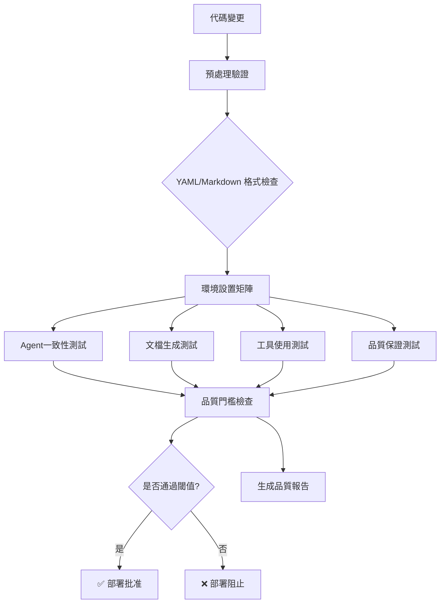

# Create Requirements Task CI/CD Pipeline

[](https://github.com/your-org/cursor-claude/actions/workflows/create-requirements-ci.yml)
[](#quality-metrics)
[](#testing-framework)

**Create Requirements Task** 的完整 CI/CD 測試管道，專為 SUNNYCORE AI 代理系統設計，確保需求分析任務的品質、一致性和可靠性。

## 🎯 專案概述

本 CI/CD 管道針對 `create-requirements` 任務提供全方位的自動化測試，涵蓋：

- **🤖 Agent 行為一致性測試** - 確保相同輸入產生穩定輸出
- **📄 文檔生成品質測試** - 驗證 YAML 模板格式合規性
- **🔧 工具調用準確性測試** - 檢查 Sequential-thinking 和 Todo-list 工具使用
- **✨ 綜合品質保證測試** - 專業需求分析標準評估

## 🏗️ 系統架構



## 🚀 快速開始

### 環境需求

- **Node.js** >= 18.0.0
- **npm** 或 **pnpm**
- **Anthropic Claude API** 訪問權限

### 1. 安裝依賴

```bash
cd ci-cd/create-requirements
npm install
```

### 2. 配置環境變數

```bash
# 複製範本配置
cp .env.example .env

# 編輯配置文件
nano .env
```

**必要配置**：
```bash
ANTHROPIC_API_KEY=your_anthropic_api_key_here
```

**可選配置**（調整測試行為）：
```bash
TEST_RUNS=3                        # 一致性測試執行次數
AGENT_CONSISTENCY_THRESHOLD=90     # Agent一致性閾值 (%)
DOC_QUALITY_THRESHOLD=85           # 文檔品質閾值 (%)
TOOL_USAGE_THRESHOLD=95            # 工具使用閾值 (%)
```

### 3. 執行測試

```bash
# 執行完整測試套件
npm test

# 執行特定測試類型
npm run test:agent-consistency
npm run test:doc-quality
npm run test:tool-usage
npm run test:quality-assurance

# 執行品質門檻檢查
npm run quality-gate
```

## 📊 品質指標

| 指標類別 | 預設閾值 | 開發環境閾值 | 說明 |
|---------|---------|------------|-----|
| Agent一致性 | 90% | 80% | 相同輸入多次執行的相似度 |
| 文檔品質 | 85% | 75% | 模板格式合規性和內容完整性 |
| 工具使用 | 95% | 90% | 必要工具的正確調用 |
| 模板合規性 | 100% | 100% | 嚴格的 YAML 格式要求 |
| 整體成功率 | 90% | 85% | 所有測試的綜合通過率 |

## 🧪 測試框架

### Promptfoo 整合

本專案使用 [Promptfoo](https://www.promptfoo.dev/) 作為 AI 測試框架：

```yaml
# tests/agent-consistency.yml 範例
tests:
  - description: "簡單需求分析一致性測試"
    vars:
      user_input: "我想建立一個待辦事項管理應用"
    options:
      runs: 5  # 執行5次確保一致性
    assert:
      - type: similarity
        threshold: 0.85
      - type: contains-all
        values: ["functional_requirements", "non_functional_requirements"]
```

### 自定義評估器

系統提供專門的評估函數：

- **`yaml-structure`** - YAML 結構完整性檢查
- **`requirements-completeness`** - 需求完整性評估  
- **`tool-usage-check`** - 工具調用驗證
- **`professional-quality`** - 專業標準評估

## 🔄 CI/CD 工作流程

### GitHub Actions 管道

```yaml
# .github/workflows/create-requirements-ci.yml
name: 'Create Requirements Task CI/CD Pipeline'

on:
  push:
    branches: [ main, develop ]
    paths: [ 'general/tasks/create-requirements.md', 'ci-cd/create-requirements/**' ]
  pull_request:
    branches: [ main ]

jobs:
  # 8個階段的完整測試流程
  pre-validation: ...
  setup-environment: ...  
  agent-consistency-tests: ...
  document-consistency-tests: ...
  tool-usage-tests: ...
  quality-assurance-tests: ...
  quality-gate-check: ...
  deployment-decision: ...
```

### 多環境支援

| 環境 | 用途 | 測試嚴格程度 |
|-----|------|------------|
| `dev` | 開發測試 | 較寬鬆 (2次運行, 80%閾值) |
| `test` | 標準測試 | 標準 (3次運行, 85-90%閾值) |
| `prod` | 生產驗證 | 嚴格 (5次運行, 90-95%閾值) |

## 📁 專案結構

```
ci-cd/create-requirements/
├── .github/workflows/          # GitHub Actions 工作流程
│   └── create-requirements-ci.yml
├── tests/                      # 測試配置
│   ├── agent-consistency.yml
│   ├── doc-generation-consistency.yml
│   ├── tool-usage-consistency.yml
│   └── quality-assurance.yml
├── prompts/                    # Prompt 模板
│   ├── create-requirements-stage1.md
│   └── create-requirements-full.md
├── scripts/                    # 工具腳本
│   └── quality-gate.js
├── examples/                   # 示例和測試資料
│   └── sample-inputs.md
├── docs/                       # 文檔
│   └── env-config.md
├── promptfoo.config.js         # Promptfoo 配置
└── README.md
```

## ⚙️ 高級配置

### 自定義品質閾值

```bash
# 針對不同專案調整閾值
AGENT_CONSISTENCY_THRESHOLD=85    # 降低一致性要求
DOC_QUALITY_THRESHOLD=90          # 提高文檔品質要求
TOOL_USAGE_THRESHOLD=100          # 要求完美工具使用

# 測試行為調整
TEST_RUNS=5                       # 增加測試次數提高可信度
PARALLEL_TESTS=true               # 啟用並行測試
```

### API 端點自定義

```bash
# 使用自定義 Claude API 端點
ANTHROPIC_BASE_URL=https://your-custom-endpoint.com
ANTHROPIC_MODEL=claude-3-5-sonnet-20241022

# API 請求調優
TEST_TIMEOUT=30                   # 單次測試超時（秒）
RATE_LIMIT_DELAY=1000            # API 請求間隔（毫秒）
```

## 📈 品質報告

### 自動化報告生成

每次測試執行後，系統會生成：

1. **JSON 詳細報告** (`test-results/quality-report.json`)
2. **Markdown 摘要報告** (`test-results/quality-report.md`)
3. **GitHub PR 評論** (Pull Request 時自動添加)

### 報告內容

```markdown
# Create Requirements Task 品質報告

**生成時間**: 2024-01-15 14:30:25
**整體結果**: ✅ 通過

## 品質指標詳情

| 類別 | 分數 | 閾值 | 狀態 | 差距 |
|------|------|------|------|------|
| Agent一致性 | 92.5% | 90% | ✅ | +2.5% |
| 文檔品質 | 87.3% | 85% | ✅ | +2.3% |
| 工具使用 | 96.7% | 95% | ✅ | +1.7% |
| 模板合規性 | 100.0% | 100% | ✅ | +0.0% |
```

## 🔧 故障排除

### 常見問題

**1. API 配額限制**
```bash
# 症狀：429 Too Many Requests
# 解決：降低測試頻率
TEST_RUNS=1
TEST_TIMEOUT=60
```

**2. 品質門檻過高**
```bash
# 症狀：測試一直失敗但輸出看起來正確
# 解決：調整閾值
AGENT_CONSISTENCY_THRESHOLD=75
DOC_QUALITY_THRESHOLD=70
```

**3. 工具調用檢測失敗**
```bash
# 症狀：Tool usage tests 失敗
# 檢查：Prompt 模板是否明確要求使用工具
# 確保：Sequential-thinking Tool 和 Todo-list Tool 都有被明確提及
```

### 調試模式

```bash
# 啟用詳細日誌
DEBUG=true npm test

# 保存中間結果
SAVE_INTERMEDIATE_RESULTS=true npm test

# 單步執行測試
npm run test:debug
```

## 🤝 貢獻指南

### 添加新測試

1. **創建測試配置**
   ```yaml
   # tests/your-new-test.yml
   tests:
     - description: "您的測試描述"
       vars:
         user_input: "測試輸入"
       assert:
         - type: your-custom-assertion
   ```

2. **更新 promptfoo 配置**
   ```javascript
   // promptfoo.config.js
   tests: [
     // ... existing tests
     'tests/your-new-test.yml'
   ]
   ```

3. **添加自定義評估器**
   ```javascript
   customGraders: {
     'your-custom-assertion': (output, expected) => {
       // 您的評估邏輯
       return { pass: true, score: 0.95, reason: "測試通過" };
     }
   }
   ```

### 測試最佳實踐

- **描述性測試名稱** - 使用清楚的中英文描述
- **合理的閾值設定** - 平衡品質要求和實用性
- **多樣化測試案例** - 涵蓋簡單、複雜和邊界條件
- **一致的ID格式** - 遵循 `F-001`, `NFR-P-001` 等格式

## 📚 相關資源

- **[SUNNYCORE CI/CD 規範](./SUNNYCORE-CI-CD-WORKFLOW.md)** - 完整的CI/CD工作流程規範
- **[環境配置指南](./docs/env-config.md)** - 詳細的環境變數配置說明
- **[Create Requirements 任務定義](../../general/tasks/create-requirements.md)** - 原始任務規格
- **[Promptfoo 文檔](https://www.promptfoo.dev/docs/)** - 測試框架使用指南

## 📄 授權

本專案遵循 MIT 授權條款。詳見 [LICENSE](./LICENSE) 文件。

## 🏷️ 版本歷史

### v1.0.0 (2024-01-15)
- ✨ 初版發布
- 🤖 完整的 Agent 一致性測試套件
- 📄 文檔生成品質驗證
- 🔧 工具使用準確性檢查
- ✨ 綜合品質保證評估
- 🚀 GitHub Actions CI/CD 管道
- 📊 自動化品質報告生成

---

**由 SUNNYCORE AI 代理系統驅動** | **專業需求工程自動化測試**
