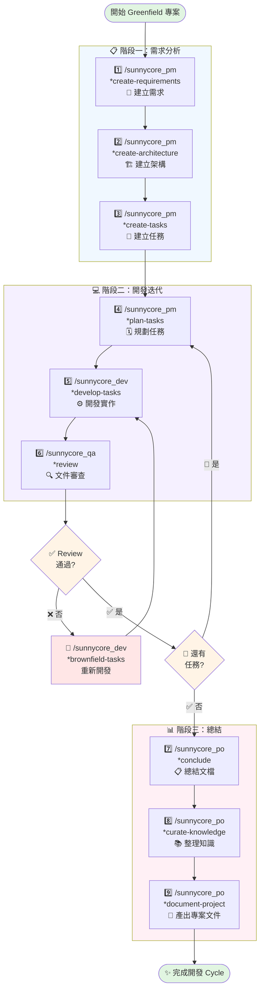
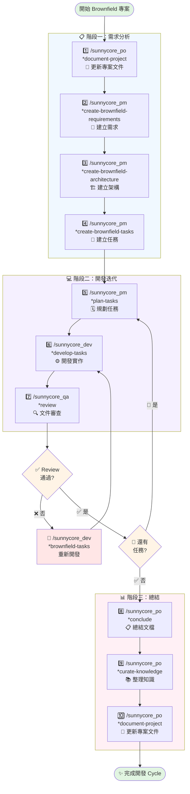

# 開發流程

## 🌱 Greenfield 專案流程

> 適用於從零開始的新專案開發

### 📋 階段一：需求分析

| 步驟 | 命令 | 說明 |
|------|------|------|
| 1 | `/sunnycore_pm *create-requirements` | 互動式創建需求文檔 |
| 2 | `/sunnycore_pm *create-architecture` | 互動式創建架構文檔 |
| 3 | `/sunnycore_pm *create-tasks` | 互動式創建任務文檔 |

### 💻 階段二：開發迭代

| 步驟 | 命令 | 說明 |
|------|------|------|
| 4 | `/sunnycore_pm *plan-tasks {task_id}` | 創建特定 task 的計劃文檔 |
| 5 | `/sunnycore_dev *develop-tasks {task_id}` | 創建特定 task 的開發文檔 |
| 6 | `/sunnycore_qa *review {task_id}` | 審查特定 task 的文檔 |

**流程控制：**
- ✅ **Review 通過**：檢查是否還有其他任務
  - 有任務 → 回到步驟 4
  - 無任務 → 進入階段三
- ❌ **Review 未通過**：使用 `/sunnycore_dev *brownfield-tasks {task_id}` 進行重開發，回到步驟 5

### 📊 階段三：總結與文檔化

| 步驟 | 命令 | 說明 |
|------|------|------|
| 7 | `/sunnycore_po *conclude` | 總結文檔 |
| 8 | `/sunnycore_po *curate-knowledge` | 整理知識文檔 |
| 9 | `/sunnycore_po *document-project` | 產出專案架構文件 |

### 🔄 流程圖

---

## 🏗️ Brownfield 專案流程

> 適用於現有專案的擴展與維護

### 📋 階段一：需求分析

| 步驟 | 命令 | 說明 |
|------|------|------|
| 1 | `/sunnycore_po *document-project` | 確保專案架構文件是最新的 |
| 2 | `/sunnycore_pm *create-brownfield-requirements` | 互動式創建需求文檔 |
| 3 | `/sunnycore_pm *create-brownfield-architecture` | 互動式創建架構文檔 |
| 4 | `/sunnycore_pm *create-brownfield-tasks` | 互動式創建任務文檔 |

### 💻 階段二：開發迭代

| 步驟 | 命令 | 說明 |
|------|------|------|
| 5 | `/sunnycore_pm *plan-tasks {task_id}` | 創建特定 task 的計劃文檔 |
| 6 | `/sunnycore_dev *develop-tasks {task_id}` | 創建特定 task 的開發文檔 |
| 7 | `/sunnycore_qa *review {task_id}` | 審查特定 task 的文檔 |

**流程控制：**
- ✅ **Review 通過**：檢查是否還有其他任務
  - 有任務 → 回到步驟 5
  - 無任務 → 進入階段三
- ❌ **Review 未通過**：使用 `/sunnycore_dev *brownfield-tasks {task_id}` 進行重開發，回到步驟 6

### 📊 階段三：總結與文檔化

| 步驟 | 命令 | 說明 |
|------|------|------|
| 8 | `/sunnycore_po *conclude` | 總結文檔 |
| 9 | `/sunnycore_po *curate-knowledge` | 整理知識文檔 |
| 10 | `/sunnycore_po *document-project` | 更新專案架構文件 |

### 🔄 流程圖

---

## 📝 流程說明

### 🌱 Greenfield vs 🏗️ Brownfield

| 特性 | Greenfield | Brownfield |
|------|-----------|------------|
| **適用場景** | 全新專案 | 現有專案擴展/維護 |
| **起始步驟** | 直接建立需求 | 先更新專案文件 |
| **需求命令** | `*create-requirements` | `*create-brownfield-requirements` |
| **架構命令** | `*create-architecture` | `*create-brownfield-architecture` |
| **任務命令** | `*create-tasks` | `*create-brownfield-tasks` |
| **總步驟數** | 9 步 | 10 步 |

### 🎯 關鍵決策點

1. **Review 檢查點**
   - 每個任務完成後都需要經過 QA 審查
   - 確保代碼質量和符合需求

2. **任務迭代**
   - Review 通過：繼續下一個任務或進入總結階段
   - Review 未通過：使用 brownfield-tasks 命令重新開發

3. **文檔更新**
   - Greenfield：結束時產出專案文件
   - Brownfield：開始前和結束時都要更新專案文件

### 💡 最佳實踐

- 📌 每個階段完成後進行檢查點確認
- 🔄 保持文檔與代碼同步
- ✅ 確保所有 Review 問題都已解決再進入下一階段
- 📚 及時整理和歸檔知識文檔
