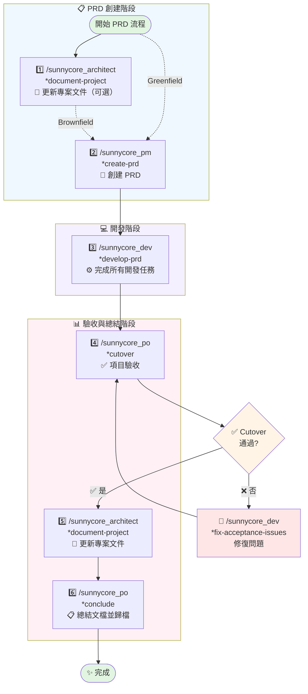
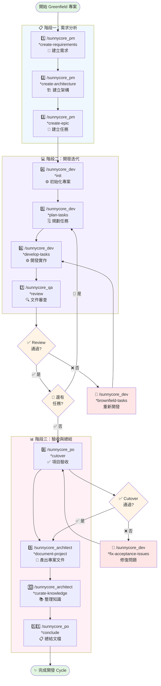
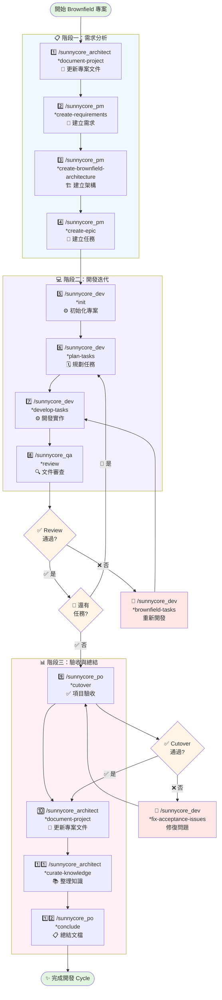

# 開發流程

## 🤔 如何選擇開發流程？

> **不確定用哪個流程？使用 `/sunnycore_pm *consult` 讓 AI 為您分析和建議！**

### 📊 流程選擇指引

| 需求特徵 | 建議流程 | 命令 |
|---------|---------|------|
| 🆕 新增系統組件或模塊 | 完整開發流程 | `*create-requirements` |
| 🏗️ 改變核心架構模式 | 完整開發流程 | `*create-requirements` |
| 🔧 新增技術棧或框架 | 完整開發流程 | `*create-requirements` |
| 🔌 新增外部整合或服務 | 完整開發流程 | `*create-requirements` |
| 📦 修改組件邊界或職責 | 完整開發流程 | `*create-requirements` |
| 🛡️ 重大橫切關注點變更 | 完整開發流程 | `*create-requirements` |
| ✏️ 現有組件內的修改 | PRD 流程 | `*create-prd` |
| ✨ 使用現有架構的功能增強 | PRD 流程 | `*create-prd` |
| 🐛 Bug 修復或技術改進 | PRD 流程 | `*create-prd` |
| 🎨 UI/UX 變更（無後端架構變更） | PRD 流程 | `*create-prd` |
| 🔍 小到中型範圍（1-5 個任務） | PRD 流程 | `*create-prd` |

### 🎯 使用 *consult 指令

**步驟：**
1. 執行 `/sunnycore_pm *consult`
2. 描述您的需求
3. AI 會自動分析現有架構（如果是 Brownfield 專案）
4. 獲得明確的流程建議和下一步指令

**優勢：**
- ✅ 自動檢測專案類型（Greenfield/Brownfield）
- ✅ 智能分析需求範圍和影響
- ✅ 提供精準的流程建議
- ✅ 節省決策時間

---

## 🛠️ 技術支援流程（新增）

> 適用於問題解答、Bug 修復、程式碼優化等日常技術支援

### 📋 使用方式

| 步驟 | 命令 | 說明 |
|------|------|------|
| 1 | `/sunnycore_assistant` | 描述您的問題或需要修復的 bug |
| 2 | 自動執行 | Assistant 分析問題並提供解決方案 |
| 3 | 自動執行 | Progress Manager 記錄重要進度和知識 |

**特點：**
- ✅ **快速響應**：即時問題解答和技術支援
- ✅ **智能記錄**：自動分類並記錄重要信息（critical/important）
- ✅ **知識累積**：Bug 修復和重要經驗自動歸檔
- ✅ **適用場景**：問題診斷、Bug 修復、程式碼優化、技術諮詢

### 📊 進度記錄說明

**progress.md 格式：**
```
{YYYY-MM-DD}:{HH:MM}: {動作描述} [{重要性}]
```

**知識庫組織：**
- `docs/progress.md` - 僅記錄 critical 和 important 級別的進度
- `docs/knowledge/*.md` - 按主題分類的 bug 修復和最佳實踐

---

## 🚀 PRD 流程（推薦用於小型變更）

> 適用於小型變更和快速迭代，將需求、架構、任務整合在單一 PRD 文檔中

### 📋 完整流程

| 步驟 | 命令 | 說明 |
|------|------|------|
| 1 | `/sunnycore_architect *document-project` | （可選）若為 Brownfield 專案，先更新架構文檔 |
| 2 | `/sunnycore_pm *create-prd` | 創建 PRD（產品需求文檔），包含需求、架構、任務 |
| 3 | `/sunnycore_dev *develop-prd` | 基於 PRD 一次性完成所有開發任務 |
| 4 | `/sunnycore_po *cutover` | 項目驗收 |
| 5 | `/sunnycore_architect *document-project` | 更新專案架構文檔 |
| 6 | `/sunnycore_po *conclude` | 總結文檔並歸檔 |

**特點：**
- ✅ **簡化流程**：合併需求、架構、任務為單一文檔
- ✅ **快速迭代**：一次性完成所有 PRD 任務
- ✅ **自動判斷**：自動識別 Greenfield/Brownfield 專案類型
- ✅ **適用場景**：小型功能開發、Bug 修復、技術改進

### 🔄 流程圖



---

## 🌱 Greenfield 專案流程

> 適用於從零開始的新專案開發

### 📋 階段一：需求分析

| 步驟 | 命令 | 說明 |
|------|------|------|
| 1 | `/sunnycore_pm *create-requirements` | 互動式創建需求文檔 |
| 2 | `/sunnycore_pm *create-architecture` | 互動式創建架構文檔 |
| 3 | `/sunnycore_pm *create-epic` | 互動式創建任務文檔 |

### 💻 階段二：開發迭代

| 步驟 | 命令 | 說明 |
|------|------|------|
| 4 | `/sunnycore_dev *init` | 初始化開發環境與專案文檔 |
| 5 | `/sunnycore_dev *plan-tasks {task_id}` | 創建特定 task 的計劃文檔 |
| 6 | `/sunnycore_dev *develop-tasks {task_id}` | 創建特定 task 的開發文檔 |
| 7 | `/sunnycore_qa *review {task_id}` | 審查特定 task 的文檔 |

**流程控制：**
- ✅ **Review 通過**：檢查是否還有其他任務
  - 有任務 → 回到步驟 5
  - 無任務 → 進入階段三
- ❌ **Review 未通過**：使用 `/sunnycore_dev *brownfield-tasks {task_id}` 進行重開發，回到步驟 6

### 📊 階段三：驗收與總結

| 步驟 | 命令 | 說明 |
|------|------|------|
| 8 | `/sunnycore_po *cutover` | 項目驗收 |
| 9 | `/sunnycore_architect *document-project` | 產出專案架構文件 |
| 10 | `/sunnycore_architect *curate-knowledge` | 整理知識文檔 |
| 11 | `/sunnycore_po *conclude` | 總結文檔 |

**流程控制：**
- ✅ **Cutover 通過**：進入總結流程（步驟 9）
- ❌ **Cutover 未通過**：使用 `/sunnycore_dev *fix-acceptance-issues` 進行修復，回到步驟 8

## ⚙️ 配置說明

### MCP 伺服器配置

本專案使用 Model Context Protocol (MCP) 伺服器提供增強功能。配置文件位於 `mcp.json`。

**必要步驟：配置 API Keys**

在使用前，請先在 `mcp.json` 中填入您自己的 API keys：

1. **Context7** - 需要填入 `CONTEXT7_API_KEY`
2. **Claude Context** - 需要填入以下環境變數：
   - `EMBEDDING_MODEL`: 嵌入模型名稱
   - `OPENAI_API_KEY`: OpenAI API key
   - `OPENAI_BASE_URL`: OpenAI API 基礎 URL
   - `MILVUS_TOKEN`: Milvus 向量資料庫 token

**配置範例**：
```json
{
  "mcpServers": {
    "context7": {
      "env": {
        "CONTEXT7_API_KEY": "ctx7sk-your-actual-key-here"
      }
    }
  }
}
```

⚠️ **安全提醒**：
- 請勿將包含真實 API keys 的 `mcp.json` 提交到版本控制
- 建議將此文件加入 `.gitignore`
- 使用環境變數管理敏感資訊

### 依賴清單

詳見 `DEPENDENCIES.md` 查看所需的 MCP 伺服器列表。

---

### 🔄 流程圖



---

## 🏗️ Brownfield 專案流程

> 適用於現有專案的擴展與維護

### 📋 階段一：需求分析

| 步驟 | 命令 | 說明 |
|------|------|------|
| 1 | `/sunnycore_architect *document-project` | 確保專案架構文件是最新的 |
| 2 | `/sunnycore_pm *create-requirements` | 互動式創建需求文檔 |
| 3 | `/sunnycore_pm *create-brownfield-architecture` | 互動式創建架構文檔 |
| 4 | `/sunnycore_pm *create-epic` | 互動式創建任務文檔 |

### 💻 階段二：開發迭代

| 步驟 | 命令 | 說明 |
|------|------|------|
| 5 | `/sunnycore_dev *init` | 初始化開發環境與專案文檔 |
| 6 | `/sunnycore_dev *plan-tasks {task_id}` | 創建特定 task 的計劃文檔 |
| 7 | `/sunnycore_dev *develop-tasks {task_id}` | 創建特定 task 的開發文檔 |
| 8 | `/sunnycore_qa *review {task_id}` | 審查特定 task 的文檔 |

**流程控制：**
- ✅ **Review 通過**：檢查是否還有其他任務
  - 有任務 → 回到步驟 6
  - 無任務 → 進入階段三
- ❌ **Review 未通過**：使用 `/sunnycore_dev *brownfield-tasks {task_id}` 進行重開發，回到步驟 7

### 📊 階段三：驗收與總結

| 步驟 | 命令 | 說明 |
|------|------|------|
| 9 | `/sunnycore_po *cutover` | 項目驗收 |
| 10 | `/sunnycore_architect *document-project` | 更新專案架構文件 |
| 11 | `/sunnycore_architect *curate-knowledge` | 整理知識文檔 |
| 12 | `/sunnycore_po *conclude` | 總結文檔 |

**流程控制：**
- ✅ **Cutover 通過**：進入總結流程（步驟 10）
- ❌ **Cutover 未通過**：使用 `/sunnycore_dev *fix-acceptance-issues` 進行修復，回到步驟 9

### 🔄 流程圖



---

## 📝 流程說明

### 🚀 PRD vs 🌱 Greenfield vs 🏗️ Brownfield

| 特性 | PRD 流程 | Greenfield | Brownfield |
|------|---------|-----------|------------|
| **適用場景** | 小型變更、快速迭代 | 全新專案 | 現有專案擴展/維護 |
| **文檔結構** | 單一 PRD 文檔 | 分離的需求、架構、任務文檔 | 分離的需求、架構、任務文檔 |
| **起始步驟** | 創建 PRD | 直接建立需求 | 先更新專案文件 |
| **需求命令** | `*create-prd` | `*create-requirements` | `*create-requirements` |
| **架構命令** | 內建於 PRD | `*create-architecture` | `*create-brownfield-architecture` |
| **任務命令** | 內建於 PRD | `*create-epic` | `*create-epic` |
| **開發命令** | `*develop-prd`（一次性） | `*develop-tasks`（逐個） | `*develop-tasks`（逐個） |
| **總步驟數** | 6 步 | 11 步 | 12 步 |
| **適合規模** | 小型（1-5 個任務） | 中大型（5+ 個任務） | 中大型（5+ 個任務） |

### 🎯 關鍵決策點

1. **Review 檢查點**
   - 每個任務完成後都需要經過 QA 審查
   - 確保代碼質量和符合需求

2. **任務迭代**
   - Review 通過：繼續下一個任務或進入驗收階段
   - Review 未通過：使用 brownfield-tasks 命令重新開發

3. **Cutover 驗收檢查點** ⭐ 新增
   - 從業務和用戶角度驗收項目交付
   - Cutover 通過：進入總結和文檔化階段
   - Cutover 未通過：使用 fix-acceptance-issues 命令修復問題

4. **文檔更新**
   - Greenfield：結束時產出專案文件
   - Brownfield：開始前和結束時都要更新專案文件

### 👥 角色職責

| 角色 | 職責 | 關鍵命令 |
|------|------|----------|
| **Architect** | 技術架構設計、知識管理、技術決策支持 | *create-architecture, *create-brownfield-architecture, *conclude, *curate-knowledge, *document-project |
| **Developer** | 開發實作、任務規劃、技術實現、問題修復 | *init, *plan-tasks, *develop-tasks, *develop-prd, *fix-acceptance-issues |
| **PM** | 產品需求管理、PRD 創建 | *create-requirements, *create-prd, *create-epic |
| **PO** | 業務驗收、需求確認、項目交付 | *cutover |
| **QA** | 代碼審查、質量保證 | *review |

### 💡 最佳實踐

- 📌 每個階段完成後進行檢查點確認
- 🔄 保持文檔與代碼同步
- ✅ 確保所有 Review 問題都已解決再進入下一階段
- 📚 及時整理和歸檔知識文檔
