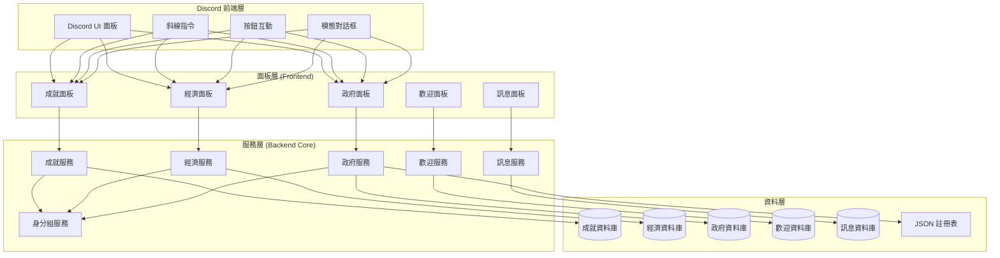

# 設計文件

## 概述

本設計文件描述了Discord機器人模組化系統的架構設計，該系統將現有的單體架構重構為前後端分離的模組化架構，並新增成就系統、經濟系統和政府系統。設計遵循SOLID原則和微服務架構理念，確保系統的可擴展性、可維護性和可測試性。

## 架構

### 整體架構圖



### 分層架構設計

#### 1. 面板層 (Frontend Layer)
負責處理所有使用者介面邏輯，包括Discord互動、按鈕、模態對話框等。

**職責：**
- 處理Discord互動事件
- 驗證使用者輸入
- 格式化輸出訊息
- 管理UI狀態

**設計原則：**
- 不包含業務邏輯
- 僅負責資料展示和使用者互動
- 通過服務層API與後端通訊

#### 2. 服務層 (Backend Core Layer)
包含所有業務邏輯和核心功能實作。

**職責：**
- 實作業務規則
- 資料驗證和處理
- 跨模組協調
- 權限控制

#### 3. 資料層 (Data Layer)
負責資料持久化和存取。

**職責：**
- 資料庫操作
- 檔案系統操作
- 資料一致性保證

## 元件和介面

### 核心基礎類別

#### BaseService 抽象類別
```python
from abc import ABC, abstractmethod
from typing import Any, Dict, Optional
import logging

class BaseService(ABC):
    """所有服務的基礎抽象類別"""
    
    def __init__(self, database_manager: 'DatabaseManager'):
        self.db = database_manager
        self.logger = logging.getLogger(self.__class__.__name__)
    
    @abstractmethod
    async def initialize(self) -> bool:
        """初始化服務"""
        pass
    
    @abstractmethod
    async def cleanup(self) -> None:
        """清理資源"""
        pass
    
    async def validate_permissions(self, user_id: int, guild_id: int, action: str) -> bool:
        """驗證使用者權限"""
        pass
```

#### BasePanel 抽象類別
```python
from abc import ABC, abstractmethod
import discord
from discord.ext import commands

class BasePanel(ABC):
    """所有面板的基礎抽象類別"""
    
    def __init__(self, service: BaseService):
        self.service = service
        self.logger = logging.getLogger(self.__class__.__name__)
    
    @abstractmethod
    async def create_embed(self, **kwargs) -> discord.Embed:
        """建立嵌入訊息"""
        pass
    
    @abstractmethod
    async def handle_interaction(self, interaction: discord.Interaction) -> None:
        """處理互動事件"""
        pass
    
    async def send_error(self, interaction: discord.Interaction, message: str) -> None:
        """發送錯誤訊息"""
        pass
    
    async def send_success(self, interaction: discord.Interaction, message: str) -> None:
        """發送成功訊息"""
        pass
```

### 成就系統設計

#### 成就服務 (AchievementService)
```python
class AchievementService(BaseService):
    """成就系統核心服務"""
    
    async def create_achievement(self, guild_id: int, achievement_data: Dict[str, Any]) -> int:
        """建立新成就"""
        pass
    
    async def update_achievement(self, achievement_id: int, updates: Dict[str, Any]) -> bool:
        """更新成就"""
        pass
    
    async def delete_achievement(self, achievement_id: int) -> bool:
        """刪除成就"""
        pass
    
    async def get_user_progress(self, user_id: int, guild_id: int) -> List[Dict[str, Any]]:
        """取得使用者成就進度"""
        pass
    
    async def award_achievement(self, user_id: int, achievement_id: int) -> bool:
        """授予成就"""
        pass
    
    async def check_achievement_triggers(self, user_id: int, guild_id: int, event_type: str, data: Dict[str, Any]) -> List[int]:
        """檢查成就觸發條件"""
        pass
```

#### 成就面板 (AchievementPanel)
```python
class AchievementPanel(BasePanel):
    """成就系統使用者介面"""
    
    async def show_user_achievements(self, interaction: discord.Interaction) -> None:
        """顯示使用者成就"""
        pass
    
    async def show_achievement_details(self, interaction: discord.Interaction, achievement_id: int) -> None:
        """顯示成就詳情"""
        pass
    
    async def show_admin_panel(self, interaction: discord.Interaction) -> None:
        """顯示管理員面板"""
        pass
    
    async def create_achievement_modal(self, interaction: discord.Interaction) -> None:
        """建立成就設定模態對話框"""
        pass
```

### 經濟系統設計

#### 經濟服務 (EconomyService)
```python
class EconomyService(BaseService):
    """經濟系統核心服務"""
    
    async def get_balance(self, account_id: str) -> float:
        """取得帳戶餘額"""
        pass
    
    async def transfer(self, from_account: str, to_account: str, amount: float, reason: str) -> bool:
        """轉帳"""
        pass
    
    async def create_account(self, account_id: str, account_type: str, initial_balance: float = 0.0) -> bool:
        """建立帳戶"""
        pass
    
    async def get_transaction_history(self, account_id: str, limit: int = 50) -> List[Dict[str, Any]]:
        """取得交易記錄"""
        pass
    
    async def set_currency_config(self, guild_id: int, name: str, symbol: str) -> bool:
        """設定貨幣配置"""
        pass
    
    async def get_currency_config(self, guild_id: int) -> Dict[str, str]:
        """取得貨幣配置"""
        pass
```

#### 帳戶類型枚舉
```python
from enum import Enum

class AccountType(Enum):
    USER = "user"
    GOVERNMENT_COUNCIL = "government_council"
    GOVERNMENT_DEPARTMENT = "government_department"
```

### 政府系統設計

#### 政府服務 (GovernmentService)
```python
class GovernmentService(BaseService):
    """政府系統核心服務"""
    
    async def create_department(self, guild_id: int, department_data: Dict[str, Any]) -> int:
        """建立政府部門"""
        pass
    
    async def update_department(self, department_id: int, updates: Dict[str, Any]) -> bool:
        """更新部門資訊"""
        pass
    
    async def delete_department(self, department_id: int) -> bool:
        """刪除部門"""
        pass
    
    async def get_department_registry(self, guild_id: int) -> List[Dict[str, Any]]:
        """取得部門註冊表"""
        pass
    
    async def ensure_council_role(self, guild: discord.Guild) -> discord.Role:
        """確保常任理事身分組存在"""
        pass
    
    async def create_department_roles(self, guild: discord.Guild, department_data: Dict[str, Any]) -> Dict[str, discord.Role]:
        """建立部門相關身分組"""
        pass
```

#### 部門註冊表結構
```python
from dataclasses import dataclass
from typing import Optional

@dataclass
class DepartmentRegistry:
    id: int
    guild_id: int
    name: str
    head_role_id: int
    head_user_id: Optional[int]
    level_role_id: int
    level_name: str
    account_id: str
    created_at: str
    updated_at: str
```

### 身分組管理服務

#### 身分組服務 (RoleService)
```python
class RoleService(BaseService):
    """身分組管理服務"""
    
    async def create_role_if_not_exists(self, guild: discord.Guild, name: str, **kwargs) -> discord.Role:
        """建立身分組（如果不存在）"""
        pass
    
    async def setup_role_hierarchy(self, guild: discord.Guild, roles_config: List[Dict[str, Any]]) -> bool:
        """設定身分組階層"""
        pass
    
    async def assign_role_to_user(self, guild: discord.Guild, user_id: int, role_id: int) -> bool:
        """指派身分組給使用者"""
        pass
    
    async def remove_role_from_user(self, guild: discord.Guild, user_id: int, role_id: int) -> bool:
        """移除使用者的身分組"""
        pass
```

## 資料模型

### 成就系統資料模型

#### 成就表 (achievements)
```sql
CREATE TABLE achievements (
    id INTEGER PRIMARY KEY AUTOINCREMENT,
    guild_id INTEGER NOT NULL,
    name TEXT NOT NULL,
    description TEXT,
    icon_url TEXT,
    reward_type TEXT NOT NULL, -- 'role', 'currency', 'badge'
    reward_data TEXT, -- JSON格式的獎勵資料
    trigger_type TEXT NOT NULL, -- 'message_count', 'voice_time', 'custom'
    trigger_condition TEXT, -- JSON格式的觸發條件
    is_hidden BOOLEAN DEFAULT FALSE,
    is_active BOOLEAN DEFAULT TRUE,
    created_at TIMESTAMP DEFAULT CURRENT_TIMESTAMP,
    updated_at TIMESTAMP DEFAULT CURRENT_TIMESTAMP
);
```

#### 使用者成就進度表 (user_achievement_progress)
```sql
CREATE TABLE user_achievement_progress (
    id INTEGER PRIMARY KEY AUTOINCREMENT,
    user_id INTEGER NOT NULL,
    guild_id INTEGER NOT NULL,
    achievement_id INTEGER NOT NULL,
    current_progress INTEGER DEFAULT 0,
    target_progress INTEGER NOT NULL,
    is_completed BOOLEAN DEFAULT FALSE,
    completed_at TIMESTAMP NULL,
    created_at TIMESTAMP DEFAULT CURRENT_TIMESTAMP,
    updated_at TIMESTAMP DEFAULT CURRENT_TIMESTAMP,
    FOREIGN KEY (achievement_id) REFERENCES achievements(id),
    UNIQUE(user_id, guild_id, achievement_id)
);
```

### 經濟系統資料模型

#### 帳戶表 (economy_accounts)
```sql
CREATE TABLE economy_accounts (
    id TEXT PRIMARY KEY, -- 格式: user_{user_id}_{guild_id} 或 gov_council_{guild_id} 或 gov_dept_{dept_id}
    account_type TEXT NOT NULL, -- 'user', 'government_council', 'government_department'
    guild_id INTEGER NOT NULL,
    balance REAL DEFAULT 0.0,
    created_at TIMESTAMP DEFAULT CURRENT_TIMESTAMP,
    updated_at TIMESTAMP DEFAULT CURRENT_TIMESTAMP
);
```

#### 交易記錄表 (economy_transactions)
```sql
CREATE TABLE economy_transactions (
    id INTEGER PRIMARY KEY AUTOINCREMENT,
    from_account TEXT,
    to_account TEXT,
    amount REAL NOT NULL,
    transaction_type TEXT NOT NULL, -- 'transfer', 'deposit', 'withdraw', 'reward'
    reason TEXT,
    created_at TIMESTAMP DEFAULT CURRENT_TIMESTAMP,
    FOREIGN KEY (from_account) REFERENCES economy_accounts(id),
    FOREIGN KEY (to_account) REFERENCES economy_accounts(id)
);
```

#### 貨幣設定表 (currency_settings)
```sql
CREATE TABLE currency_settings (
    guild_id INTEGER PRIMARY KEY,
    currency_name TEXT DEFAULT '金幣',
    currency_symbol TEXT DEFAULT '💰',
    created_at TIMESTAMP DEFAULT CURRENT_TIMESTAMP,
    updated_at TIMESTAMP DEFAULT CURRENT_TIMESTAMP
);
```

### 政府系統資料模型

#### 部門註冊表 (government_departments)
```sql
CREATE TABLE government_departments (
    id INTEGER PRIMARY KEY AUTOINCREMENT,
    guild_id INTEGER NOT NULL,
    name TEXT NOT NULL,
    head_role_id INTEGER NOT NULL,
    head_user_id INTEGER,
    level_role_id INTEGER NOT NULL,
    level_name TEXT NOT NULL,
    account_id TEXT NOT NULL,
    created_at TIMESTAMP DEFAULT CURRENT_TIMESTAMP,
    updated_at TIMESTAMP DEFAULT CURRENT_TIMESTAMP,
    FOREIGN KEY (account_id) REFERENCES economy_accounts(id)
);
```

## 錯誤處理

### 錯誤類別層次結構
```python
class BotError(Exception):
    """機器人基礎錯誤類別"""
    pass

class ServiceError(BotError):
    """服務層錯誤"""
    pass

class DatabaseError(ServiceError):
    """資料庫錯誤"""
    pass

class PermissionError(ServiceError):
    """權限錯誤"""
    pass

class ValidationError(ServiceError):
    """驗證錯誤"""
    pass

class AchievementError(ServiceError):
    """成就系統錯誤"""
    pass

class EconomyError(ServiceError):
    """經濟系統錯誤"""
    pass

class GovernmentError(ServiceError):
    """政府系統錯誤"""
    pass
```

### 錯誤處理策略
1. **服務層錯誤處理**：捕獲並記錄所有業務邏輯錯誤
2. **面板層錯誤處理**：將服務層錯誤轉換為使用者友善的訊息
3. **全域錯誤處理**：處理未預期的系統錯誤
4. **錯誤恢復機制**：提供自動重試和降級服務

## 測試策略

### 測試層次
1. **單元測試**：測試個別服務方法
2. **整合測試**：測試服務間的互動
3. **端到端測試**：測試完整的使用者流程
4. **效能測試**：測試系統在高負載下的表現

### 測試工具
- **pytest**：Python測試框架
- **pytest-asyncio**：異步測試支援
- **unittest.mock**：模擬外部依賴
- **discord.py test utilities**：Discord互動測試

### 測試資料管理
- 使用記憶體資料庫進行測試
- 測試資料隔離和清理
- 模擬Discord API回應

## 效能考量

### 資料庫最佳化
1. **索引策略**：為常用查詢欄位建立索引
2. **連線池管理**：使用連線池減少連線開銷
3. **查詢最佳化**：避免N+1查詢問題
4. **資料分頁**：大量資料使用分頁載入

### 快取策略
1. **記憶體快取**：快取常用的配置資料
2. **Redis快取**：分散式快取支援（未來擴展）
3. **快取失效**：適當的快取更新策略

### 並發處理
1. **異步操作**：所有I/O操作使用異步
2. **任務佇列**：長時間運行的任務使用佇列
3. **資源限制**：防止資源耗盡的保護機制

## 安全性

### 權限控制
1. **角色基礎存取控制**：基於Discord身分組的權限系統
2. **操作審計**：記錄所有敏感操作
3. **輸入驗證**：嚴格驗證所有使用者輸入

### 資料保護
1. **敏感資料加密**：加密儲存敏感資訊
2. **SQL注入防護**：使用參數化查詢
3. **資料備份**：定期備份重要資料

### 速率限制
1. **API速率限制**：防止API濫用
2. **使用者操作限制**：防止垃圾訊息和濫用
3. **資源使用監控**：監控系統資源使用情況

## 部署和維護

### 部署策略
1. **容器化部署**：使用Docker容器
2. **環境隔離**：開發、測試、生產環境分離
3. **零停機部署**：支援熱更新和回滾

### 監控和日誌
1. **結構化日誌**：使用JSON格式的結構化日誌
2. **效能監控**：監控關鍵效能指標
3. **錯誤追蹤**：自動錯誤報告和追蹤
4. **健康檢查**：定期系統健康檢查

### 備份和恢復
1. **自動備份**：定期自動備份資料
2. **災難恢復**：完整的災難恢復計劃
3. **資料遷移**：支援資料庫遷移和升級