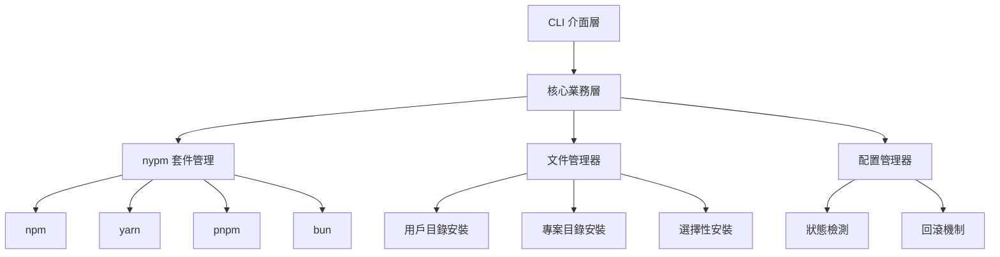

# 設計文件

## 概述

本設計文件描述了 Claude 工作流程安裝器的混合架構設計，採用現有優質解決方案（nypm、ni）作為基礎，專注開發特殊需求功能，實現高效、可靠的文件安裝系統。

## 架構

### 整體架構圖



### 分層架構設計

#### 1. CLI 介面層 (Interface Layer)
提供統一的命令列介面，參考 ni 的設計模式實現簡潔易用的指令系統。

**職責：**
- 解析用戶指令和參數
- 提供互動式選擇介面
- 顯示安裝進度和狀態
- 處理錯誤訊息展示

**設計原則：**
- 簡潔統一的指令格式
- 智能預設值和自動檢測
- 友善的錯誤提示

#### 2. 核心業務層 (Business Logic Layer)
整合現有解決方案，實現核心安裝邏輯和流程控制。

**職責：**
- 協調各子系統運作
- 實現安裝流程控制
- 處理業務邏輯驗證
- 管理安裝狀態轉換

**設計原則：**
- 模組化設計，易於擴展
- 充分利用現有優質解決方案
- 專注於特殊需求實現

#### 3. 服務層 (Service Layer)
整合 nypm API 和自開發的文件管理服務。

**職責：**
- 套件管理器自動檢測
- 文件複製和安裝操作
- 配置文件管理
- 系統狀態監控

**設計原則：**
- 利用 nypm 的成熟 API
- 實現跨平台兼容性
- 提供可靠的錯誤處理

#### 4. 基礎設施層 (Infrastructure Layer)
提供底層的文件系統操作和平台適配功能。

**職責：**
- 跨平台文件操作
- 路徑解析和驗證
- 權限檢查和處理
- 系統環境檢測

**設計原則：**
- 跨平台一致性
- 安全的文件操作
- 完善的錯誤恢復機制

## 元件和介面

### 核心管理器類別

#### InstallationManager 抽象類別
```typescript
abstract class InstallationManager {
  protected nypmApi: any;
  protected fileManager: FileSystemManager;
  protected configManager: ConfigurationManager;
  
  constructor() {
    this.nypmApi = require('nypm');
    this.fileManager = new FileSystemManager();
    this.configManager = new ConfigurationManager();
  }
  
  abstract async install(options: InstallOptions): Promise<InstallResult>;
  abstract async detect(): Promise<InstallationStatus>;
  abstract async rollback(backupId: string): Promise<void>;
  
  protected async createBackup(): Promise<string> {
    return this.fileManager.createBackup();
  }
  
  protected async validateEnvironment(): Promise<boolean> {
    return this.configManager.validateEnvironment();
  }
}
```

### Claude 安裝器設計

#### ClaudeInstaller (主要安裝服務)
```typescript
class ClaudeInstaller extends InstallationManager {
  async install(options: InstallOptions): Promise<InstallResult> {
    // 1. 環境檢測
    await this.validateEnvironment();
    
    // 2. 創建備份
    const backupId = await this.createBackup();
    
    try {
      // 3. 使用 nypm 處理套件依賴
      await this.nypmApi.installDependencies({
        cwd: options.projectRoot
      });
      
      // 4. 安裝 agents 和 commands 到用戶目錄
      await this.fileManager.installToUserDirectory([
        'agents/**/*',
        'commands/**/*'
      ]);
      
      // 5. 安裝 sunnycore 到專案根目錄
      await this.fileManager.installToProjectRoot([
        'sunnycore/**/*'
      ], options.projectRoot);
      
      // 6. 更新安裝狀態
      await this.configManager.updateInstallationStatus('completed');
      
      return { success: true, backupId };
    } catch (error) {
      await this.rollback(backupId);
      throw error;
    }
  }
  
  async detect(): Promise<InstallationStatus> {
    const userDirStatus = await this.fileManager.checkUserDirectory();
    const projectStatus = await this.fileManager.checkProjectDirectory();
    
    return {
      userDirectory: userDirStatus,
      projectDirectory: projectStatus,
      packageManager: await this.nypmApi.detectPackageManager()
    };
  }
  
  async rollback(backupId: string): Promise<void> {
    await this.fileManager.restoreFromBackup(backupId);
    await this.configManager.updateInstallationStatus('rolled_back');
  }
}
```

## 資料模型

### Claude 安裝器資料模型

#### installation_config (安裝配置表)
```sql
CREATE TABLE installation_config (
    id INTEGER PRIMARY KEY AUTOINCREMENT,
    user_home_path TEXT NOT NULL,
    project_root_path TEXT,
    package_manager TEXT NOT NULL,
    installation_status TEXT NOT NULL CHECK (installation_status IN ('pending', 'installing', 'completed', 'failed', 'rolled_back')),
    backup_id TEXT,
    installed_components TEXT, -- JSON array of installed components
    created_at DATETIME DEFAULT CURRENT_TIMESTAMP,
    updated_at DATETIME DEFAULT CURRENT_TIMESTAMP
);
```

#### file_manifest (文件清單表)
```sql
CREATE TABLE file_manifest (
    id INTEGER PRIMARY KEY AUTOINCREMENT,
    installation_id INTEGER REFERENCES installation_config(id),
    source_path TEXT NOT NULL,
    target_path TEXT NOT NULL,
    file_type TEXT NOT NULL CHECK (file_type IN ('agent', 'command', 'sunnycore', 'config')),
    file_hash TEXT NOT NULL,
    install_status TEXT NOT NULL CHECK (install_status IN ('pending', 'installed', 'failed')),
    created_at DATETIME DEFAULT CURRENT_TIMESTAMP
);
```

#### backup_records (備份記錄表)
```sql
CREATE TABLE backup_records (
    id INTEGER PRIMARY KEY AUTOINCREMENT,
    backup_id TEXT UNIQUE NOT NULL,
    installation_id INTEGER REFERENCES installation_config(id),
    backup_path TEXT NOT NULL,
    backup_size INTEGER,
    created_at DATETIME DEFAULT CURRENT_TIMESTAMP,
    expires_at DATETIME
);
```

## 錯誤處理

### 錯誤類別層次結構
```typescript
class ClaudeInstallerError extends Error {
  constructor(message: string, public code: string, public details?: any) {
    super(message);
    this.name = 'ClaudeInstallerError';
  }
}

class EnvironmentError extends ClaudeInstallerError {
  constructor(message: string, details?: any) {
    super(message, 'ENV_ERROR', details);
  }
}

class FileSystemError extends ClaudeInstallerError {
  constructor(message: string, details?: any) {
    super(message, 'FS_ERROR', details);
  }
}

class PackageManagerError extends ClaudeInstallerError {
  constructor(message: string, details?: any) {
    super(message, 'PKG_ERROR', details);
  }
}

class InstallationError extends ClaudeInstallerError {
  constructor(message: string, details?: any) {
    super(message, 'INSTALL_ERROR', details);
  }
}
```

### 錯誤處理策略
1. **漸進式降級**：優先使用 nypm，失敗時回退到直接 npm 操作
2. **自動回滾**：安裝失敗時自動恢復到安裝前狀態
3. **詳細日誌**：記錄所有操作步驟，便於問題診斷
4. **用戶友善提示**：提供清晰的錯誤訊息和解決建議

## 測試策略

### 測試層次
1. **單元測試**：測試各個類別和方法的獨立功能
2. **整合測試**：測試與 nypm API 的整合和文件操作
3. **端到端測試**：測試完整的安裝流程
4. **跨平台測試**：在 Windows、macOS、Linux 上驗證功能

### 測試工具
- **Jest**：JavaScript/TypeScript 單元測試框架
- **Mock FS**：模擬文件系統操作
- **Sinon**：模擬 nypm API 調用
- **GitHub Actions**：自動化跨平台測試

### 測試資料管理
- 使用臨時目錄進行測試，避免影響真實環境
- 模擬各種套件管理器環境（npm、yarn、pnpm、bun）
- 準備標準測試文件集合，涵蓋各種安裝場景

## 效能考量

### 安裝效能優化
1. **並行處理**：同時進行用戶目錄和專案目錄的文件安裝
2. **增量安裝**：僅安裝變更的文件，跳過已存在且未變更的文件
3. **快取機制**：快取套件管理器檢測結果和文件雜湊值
4. **流式處理**：大文件使用流式複製，減少記憶體使用

### nypm 整合優化
1. **API 重用**：重用 nypm 的套件管理器檢測邏輯
2. **依賴共享**：利用 nypm 的依賴解析和安裝能力
3. **錯誤處理**：整合 nypm 的錯誤處理機制

## 安全性

### 文件系統安全
1. **路徑驗證**：防止路徑遍歷攻擊，驗證所有文件路徑
2. **權限檢查**：安裝前檢查目標目錄的讀寫權限
3. **文件完整性**：使用雜湊值驗證文件完整性
4. **沙盒執行**：限制文件操作範圍，防止意外覆蓋系統文件

### 套件安全
1. **來源驗證**：僅從可信的 npm registry 安裝套件
2. **版本鎖定**：使用精確版本號，避免供應鏈攻擊
3. **依賴掃描**：整合 nypm 的安全掃描功能

## 部署和維護

### NPM 套件發布
1. **自動化發布**：使用 GitHub Actions 自動發布到 npm registry
2. **版本管理**：採用語義化版本控制（Semantic Versioning）
3. **多平台支援**：發布包含所有平台的通用套件
4. **向後兼容**：維護 API 向後兼容性

### 維護策略
1. **依賴更新**：定期更新 nypm 和其他依賴套件
2. **安全修補**：及時修復安全漏洞
3. **效能監控**：監控安裝效能和成功率
4. **用戶反饋**：建立問題回報和功能請求機制

### 混合方案實施階段
1. **階段一**：整合 nypm API，實現基礎安裝功能
2. **階段二**：開發專用文件安裝邏輯
3. **階段三**：優化使用者體驗，參考 ni 和 MCP Easy Installer 的設計